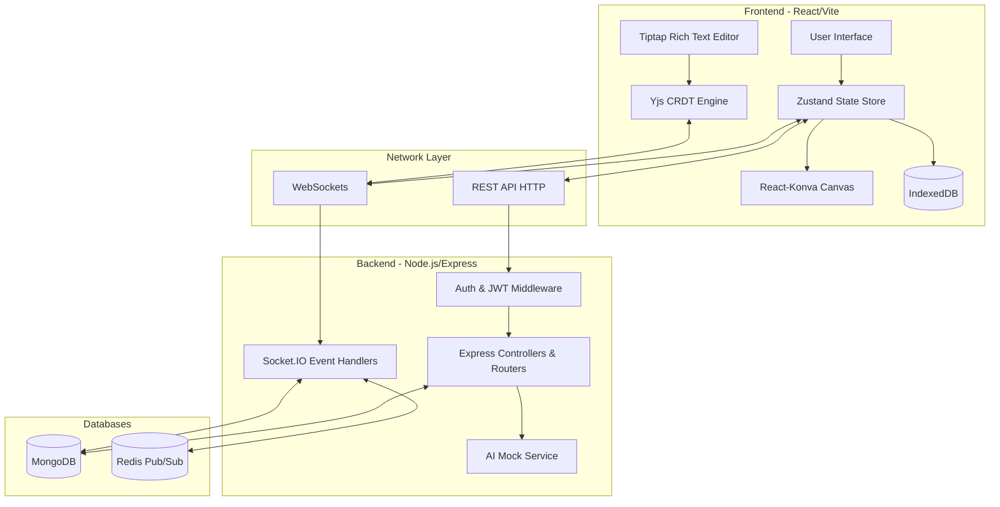

# Architecture Documentation

Opas is a high-performance, real-time collaborative workspace designed to combine the creative freedom of a whiteboard with the structured utility of meeting notes. It is built using the MERN stack (MongoDB, Express, React, Node.js) with real-time bidirectional event-based communication utilizing Socket.IO and Redis Pub/Sub for scale.

## System Architecture Diagram

## Core Components Overview

### 1. Frontend (React 18 + Vite)
- **State Management**: Zustand is utilized for fast, boilerplate-free state management spanning authentication, board state, and local caching.
- **Canvas Rendering**: React-Konva provides performant 2D canvas rendering for shapes, sticky notes, and freehand drawing.
- **Rich Text CRDT**: Tiptap integrated with Yjs enables seamless, conflict-free collaborative meeting notes editing.
- **Offline Persistence**: Background sync hooks into IndexedDB, dumping canvas state locally upon every stroke, ensuring zero data loss if network connectivity drops.

### 2. Backend (Node.js + Express)
- **API Services**: Structured using a Controller-Service-Repository pattern. It exposes robust RESTful endpoints documented via Swagger.
- **Authentication**: JWT-based authentication using short-lived access tokens and httpOnly refresh cookies for maximum security.
- **Real-time Synchronization**: Socket.IO handles broadcasting of canvas shape additions, updates, deletions, and live cursors.
- **AI Action Items**: A mocked service that processes Tiptap JSON data, extracts action items, and injects actionable TODO blocks into the collaborative document stream.

### 3. Data Tier
- **MongoDB (Mongoose)**: Primary persistent store holding Users, Workspaces, Boards, and Board Versions.
- **Redis**: Functions as a Pub/Sub adapter for Socket.IO, ensuring real-time events propagate correctly across horizontally scaled backend Node instances.
